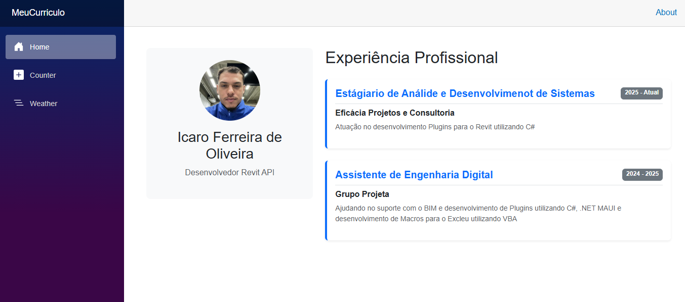

# Meu Currículo - Aplicação Blazor 💻

Este repositório contém o desenvolvimento de um currículo interativo e digital, criado como parte das atividades da disciplina de Interação Humano Computador e UX.

**Instituição:** Centro Universitário UNA  
**Disciplina:** Interação Humano Computador e UX  
**Professor:** Daniel Henrique Matos de Paiva  

---

## 👤 Identificação
* **Nome Completo:** Icaro Ferreira de Oliveira
* **Curso:** Análise e Desenvolvimento de Sistemas (ADS)

---

## 🛠️ Tecnologia Utilizada
* **Framework:** Blazor (Microsoft)
* **Linguagens:** C#, HTML, CSS
* **Plataforma:** .NET

---

## 🚀 Guia de Execução
Para executar este projeto localmente na sua máquina, siga os passos abaixo no seu terminal:

1. **Clone este repositório:**
   ```bash
   git clone [https://github.com/seu-usuario/seu-repositorio.git](https://github.com/seu-usuario/seu-repositorio.git)
   ```

2. **Acesse a pasta do projeto:**
   ```bash
   cd NomeDaPastaDoProjeto
   ```

3. **Execute a aplicação (preferencialmente com o perfil HTTPS para evitar erros de redirecionamento):**
   ```bash
   dotnet run --launch-profile https
   ```

4. **Acesse no navegador:** O terminal exibirá a URL local (geralmente `https://localhost:7xxx` ou `http://localhost:5xxx`). Copie e cole no seu navegador para visualizar o currículo.

---

## 📸 Screenshot da Aplicação


*(Nota: Certifique-se de que o arquivo da imagem esteja salvo na raiz do repositório ou ajuste o caminho acima para a pasta correta onde a imagem foi salva).*

---

## 🧠 Heurística de Nielsen Aplicada

**Ajuda e Documentação (Help and documentation)**
A aplicação do currículo foi projetada para ser intuitiva e fácil de usar sem a necessidade de manuais complexos. No entanto, a implementação desta heurística se dá exatamente através da criação deste **README.md**. 

Ele serve como a documentação oficial do sistema, sendo:
1. **Fácil de buscar:** Localizado na raiz do repositório, é a primeira coisa que o usuário (ou avaliador) lê.
2. **Focada na tarefa do usuário:** Fornece passos diretos e claros ("Guia de Execução") para que qualquer pessoa consiga compilar e rodar o projeto sem jargões desnecessários, cumprindo o objetivo de guiar o usuário na tarefa de visualização do sistema.
